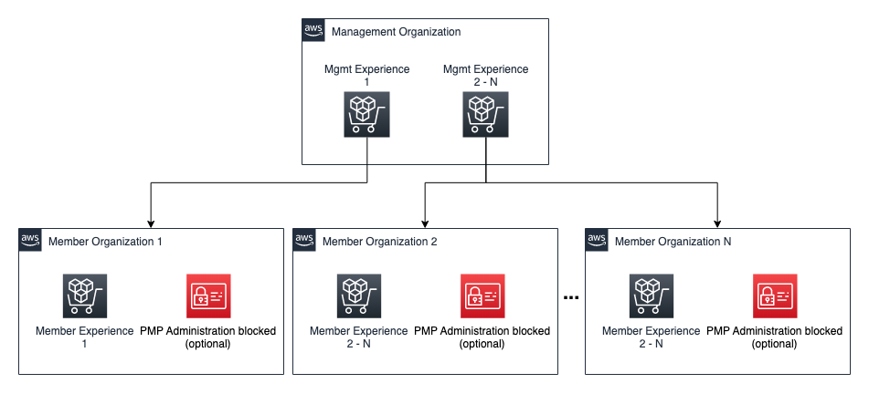
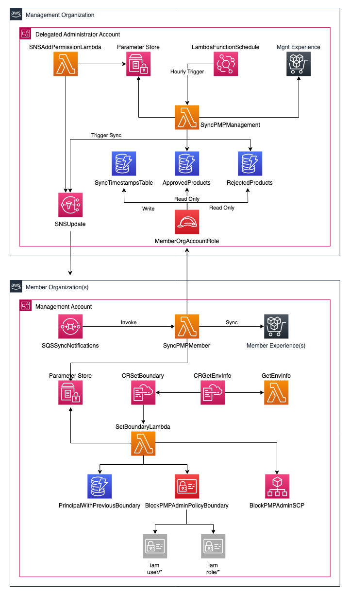
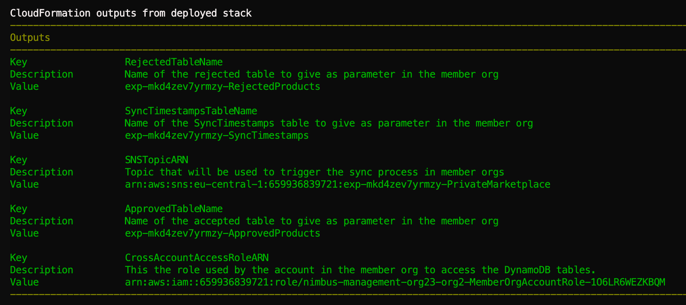

# AWS-Private-Marketplace-Cross-Org-Management

## Overview

Private marketplace is a feature built on top of AWS Marketplace, and enables your administrators to create and customize curated digital catalogs of approved independent software vendors (ISVs) and products that conform to their in-house policies. Users in your AWS account can find, buy, and deploy approved products from your private marketplace, and ensure that all available products comply with your organization’s policies and standards.

Private Marketplace is designed to work within your AWS Organization. Enterprises having multiple AWS organizations can take advantage of this solution to keep their private marketplace experiences synchronized and manage their multiple organizations Private Marketplaces centrally. Another optional feature this solution offers is the capability to enforce central administration, so no changes can be done to private marketplace experiences in member organization, but only from the management organization.

Bellow is some terminology, that will be use in this document in order to easily visualize and name the components in the solution:

1. **Management Organization**: The organization that will be used to manage all Private Marketplaces centrally.
2. **Member Organization**: An organization whose Private Marketplace will be managed remotely form the management organization.
3. **Experience**: A catalog of approved and rejected products.
4. **Management experience**: a catalog of approved and rejected products defined in the management organization that applies to 1 or many member orgs.
5. **Member experience**: a private marketplace experience(catalog) of approved and rejected products that is a synced with its management experience.



## The solution

This distributed serverless application provides a centralized way for managing Private Marketplace across multiple AWS Organizations.

It's compose of 2 main components.

1. The AWS Private Marketplace Cross Organization Management component, that get deployed in the management organization and is found [here](https://code.amazon.com/packages/AWS-Private-Marketplace-cross-Org-main/trees/ozzambra)

2. The AWS Private Marketplace Cross Organization Member component that get deployed in a member organization and can be found [here](https://code.amazon.com/packages/AWS-Private-Marketplace-cross-Org-secondary/trees/ozzambra)

For each Member organization that should be managed/synced with both components need to be deployed, in the appropriate accounts.



The component in the management organization observes a specific private marketplace experience, that is provided as parameter at deployment time and triggers the 2nd component in the member organization(s). The second component make sure that the local private marketplace experience(s) in the member account get synced with the data provided by the 1st component. Once the local private marketplace experience(s) are updated, a table in the management organization is updated with the sync timestamp. This is done for monitoring purposes.

### Detailed functionality

#### At the Management Organization

1. The process get executed hourly.
2. All allowed and rejected products of the management experience are copied to a DB to expose them to sync them with the member orgs.
3. A notification is sent to all member accounts subscribed to that management experience to start the sync process.

#### At the Members Organization(s)

1. The sync process is triggered by the notification sent by the management organization.
2. All member approved and rejected products are retrieved from the local member experience(s).
3. Approved and Rejected products are read from the management organization.
4. Local member experience(s) are updated to have the same products as the management experience.
5. The member organization notifies of it successfully synchronization to the management organization.

## Requirements

* Administrator Access to the management account of the management organization (Needed only for deployment) (Todo: Check if this can be other account)
* Administrator Access to the management account of the member orgs (Needed only for deployment)
* Private Marketplace created in the management and member Orgs
* An Management experience (Private Marketplace experience in the management organization) for every set of member orgs that will be managed
* An active member experience (Private Marketplace experience in the member organization) with the member's management account associated.
* If you want to block Private Marketplace administration in a member orgs, Service Control Policies (SCP) need to be enabled in AWS Organization. How to [here](https://docs.aws.amazon.com/organizations/latest/userguide/orgs_manage_policies_enable-disable.html#enable-policy-type).

## Set Up (Management Organization)

You need to repeat the steps bellow for every member AWS organization's private marketplace that should be managed.

1. Log into the AWS Web Console of your Management organization's management account.
2. Make sure you are in the region where you want to deploy the solution.
3. Open a AWS CloudShell console.
4. To download the solution and deploy it, execute the following commands:

```bash
git clone ssh://git.amazon.com/pkg/AWS-Private-Marketplace-cross-Org-main management-org
cd management-org
sam build
sam deploy --guided --capabilities="CAPABILITY_NAMED_IAM"
 ```

 At this point you are going to be interactively asked for parameters required by the deployment. Each parameter description can be found at the Appendix of this document.

**Important**: please provide no on the **OnlyCrossAccountAccessRole** parameter if you are setting the replication of a private marketplace experience id for the first time. If there is already a member organization syncing the same private marketplace experience id the value should be yes.

 After the application is deployed you will get outputs parameter like in the screenshot bellow. This parameters are necessary for deploying the application in the member organization. Please share then accordantly.

 

## Set Up (Member Organization)

1. Log into the AWS Web Console of your Member organization's management account.
2. Make sure you are in the region where you want to deploy the solution.
3. Open a AWS CloudShell console.
4. To download the solution and deploy it, execute the following commands:

```bash
git clone ssh://git.amazon.com/pkg/AWS-Private-Marketplace-cross-Org-secondary member-org
cd member-org
sam build
sam deploy --guided --capabilities="CAPABILITY_NAMED_IAM"
 ```

 At this point you are going to be interactively asked for parameters required by the deployment. Each parameter description can be found at the Appendix of this document. Some of them are the output parameter of the deployment in the management organization. If you didn't deploy the management organization solution these will be shared with you.

 The parameter named `BlockPMPAministration` is used to block the private marketplace administration in the AWS Organization. As this will act under all accounts please evaluate the consider if it might be disruption for your environment.

 The blocking is done using two functionalities:

 1. Service Control Policies(SCPs) set at the root Organization Unit. Setting the SCP at this level make all members accounts in the organization subject to it.
 2. Permission boundaries set to all users and roles in the management account. Permission boundaries are used as SCPs as the management account can't be subject to an SCP.

 **Important** If activated, creating new users are role in the management account will required to have tje `BlockPMPAdminPolicyBoundary` permission boundary attached to it to enforce the blocking of the Private Marketplace administration. If necessary this can be circumvented either by creating the new User or Role using the Root user or a principal that does have the boundary set.

 Every new role or user will be requested to have this boundary at creation. This can only be ignore if you create the user or role from a principal that hasn't had the boundary itself.

The two parameter listed below allow to defined a comma separated list of User and Roles will be ignore while setting the permission boundaries.

 1. IgnoreBoundaryForUsers
 2. IgnoreBoundaryForRoles

## Clean up

If you would like to delete the solution you deployed preiously, you can do it either using the CloudFormation Web Console in the accounts where you deployed them or  using the SAM CLI in CloudShell. Assuming you used your project name for the stack name, you can run the following:

### Clean up (Management Organization)

1. Log into the AWS Web Console of your **management organization's** management account.
2. Make sure you are in the region where you want to deploy the solution.
3. Open a AWS CloudShell console.
4. Execute the following commands:

```bash
sam delete --no-prompts --stack-name <MANAGEMENT_ORG_STACK_NAME>
 ```

### Clean up (Member Organizations)

1. Log into the AWS Web Console of your **member organization's** management account.
2. Make sure you are in the region where you want to deploy the solution.
3. Open a AWS CloudShell console.
4. Execute the following commands:

```bash
sam delete --no-prompts --stack-name <MEMBER_ORG_STACK_NAME>
 ```

# Appendix

## Management Organization deployment parameters

1. **ManagementExperienceId**: Management Experience ID that will be synchronized with the member organization. Check the "Finding your management experience ID" section of the Appendix, if you don't know how to find this value.

2. **MemberOrgAccountId**: Member organization's Management Account ID.

3. **OnlyCrossAccountAccessRole**: Should be yes, **only** if you want to add a new member organization to an existing synchronization.

## Member Organization deployment parameters

1. **CrossAccountAccessRoleARN**: The ARN for the role that can be assumed by this account in order to read the DynamoDB tables of approved and Blocked Products in the management organization. You will get this value from the solution deployed in the management Organization.

2. **SNSTopicARN**: The SNS topic notifying an update is available. You will get this value from the solution deployed in the management Organization.

3. **ApprovedTableName**: Name of Approved Products DynamoDB table in the management organization. You will get this value from the solution deployed in the management Organization.

4. **RejectedTableName**: Name of Rejected Products DynamoDB table in the management organization. You will get this value from the solution deployed in the management Organization.

5. **SyncTimestampsTableName**: Name of the SyncTimestamps table in the management organization. You will get this value from the solution deployed in the management Organization.

6. **MemberExperienceIds**: Local experience Id(s) to where the experience in the management org should be synced. If left in black the all experience in the local account will be synced.

7. **BlockPMPAministration**: To block Private Marketplace administration from all accounts in your AWS Organization using SCPs.

8. **IgnoreBoundaryForUsers**: Comma separated list of users that won't be subject to the BlockPMPAdminBoundary.

9. **IgnoreBoundaryForRoles**: Comma separated list of roles that won't be subject to the BlockPMPAdminBoundary.

## Finding your management experience ID

1. Open the AWS Web Console in your management organization's management account.
2. Open [Private Marketplace management portal](https://aws.amazon.com/marketplace/privatemarketplace)
3. On the left menu, select **Experiences**
4. Click on the experience you would like to use as your management experience.
5. Note the URL in your browser. It should look similar to this <https://aws.amazon.com/marketplace/privatemarketplace#/experiences/exp-kjz7te6oj7i22>. In this case the experience ID is the last segment of the URL. In this case *exp-kjz7te6oj7i22*.
